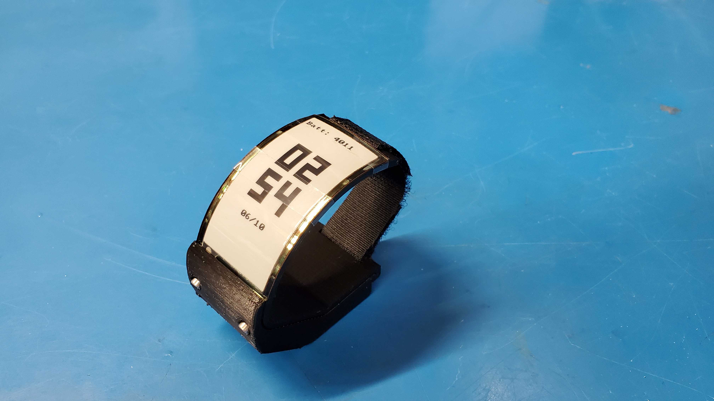
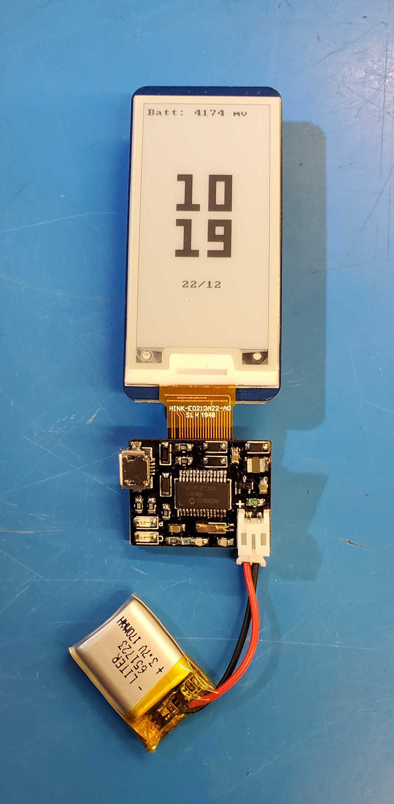
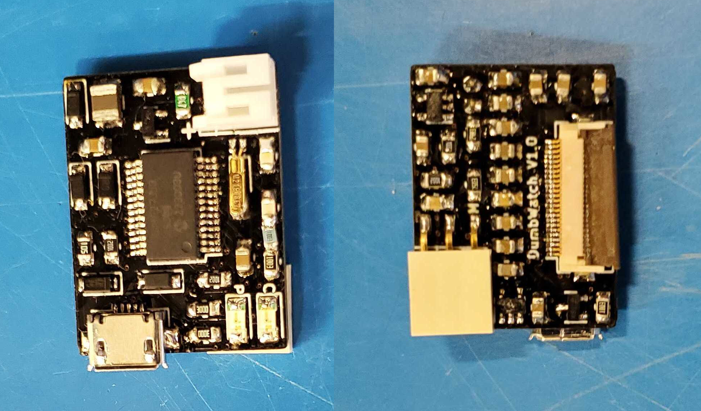

# DumbWatch - An offline-first E-paper smartwatch

## Images

The final assembled watch.

Running a battery life and RTC test using a stand-in display.

Both sides of the custom PCB.

## Features

Dumbwatch is designed to be minimalist, with its most notable (anti-)feature being a lack of wireless connectivity. It still packs in a few nice-to-haves though:

- Two months of battery life on a 170 mAh LiPo
- LiPo charging over USB
- An E-paper dispay driver compatible with most common displays
- Communication over USB, e.g. for setting the time or loading your calendar for the day

The board is powered by the PIC18F27J53, which has an internal RTC connected to a 32.768 kHz watch crystal. I have not observed any noticble drift in the time thus far.
